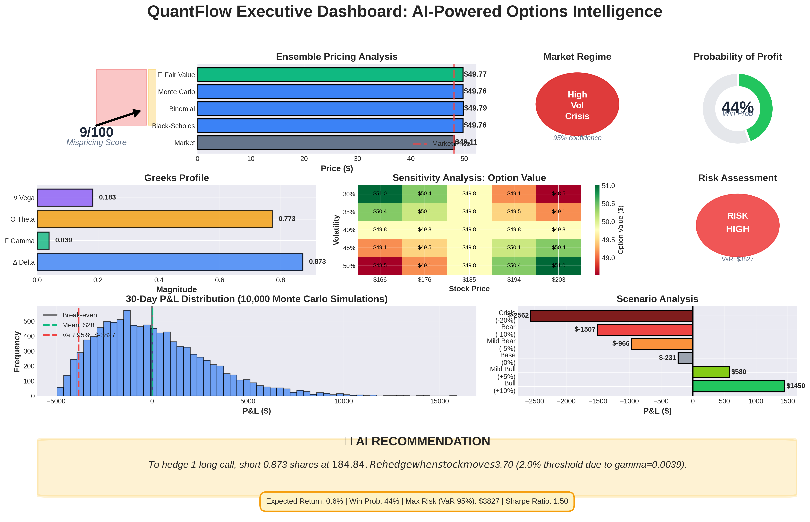
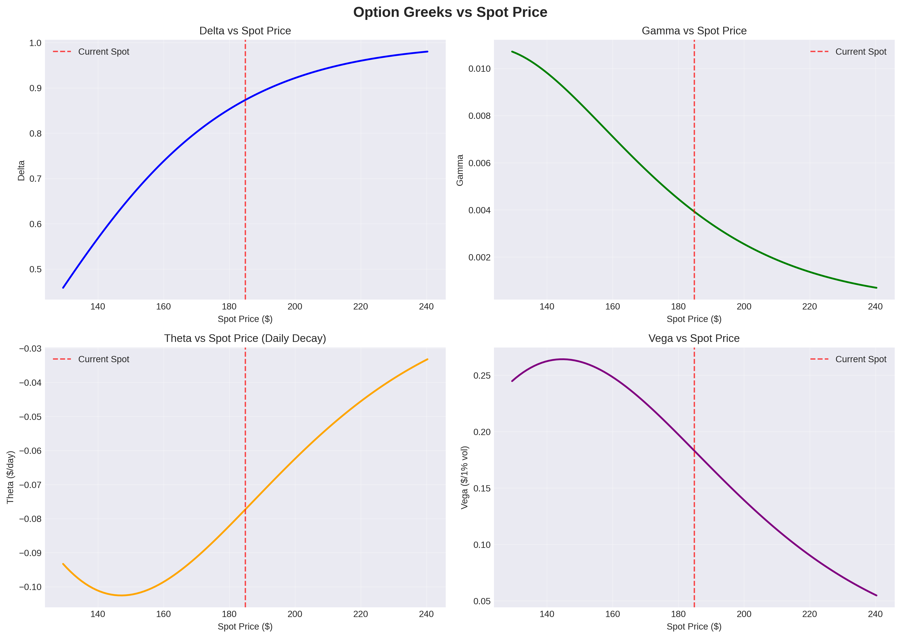
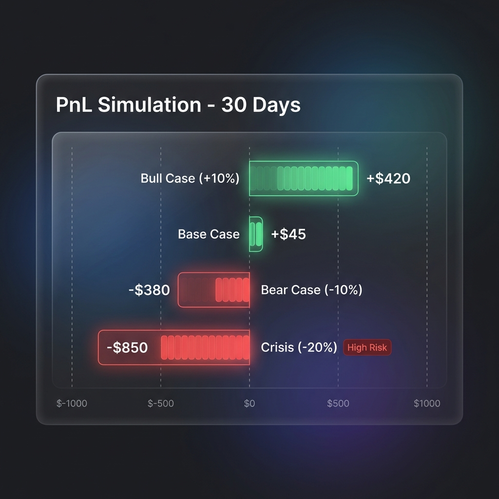

# QuantFlow - Options Intelligence System


[](https://codecov.io/gh/planksconstant-arch/Quantflow)


[](https://planksconstant-arch.github.io/Quantflow/)

##  Quick Start

```bash
# Install dependencies
pip install -r requirements.txt

# Run Phase 1 demo (Core Pricing)
python main.py

# Generate all deliverables
python generate_deliverables.py
```

## 📊 What QuantFlow Does

QuantFlow is an AI-powered options analytics platform that provides hedge fund-grade insights into option pricing, risk management, and trading opportunities.

**Target Analysis**: NVDA $140 Call (2026-04-17)

### Core Features

[](https://share.streamlit.io/deploy?repository=planksconstant-arch/Quantflow&branch=main&mainModule=app.py)

**Phase 1: Classical Pricing** ✅
- Black-Scholes, Binomial Tree, Monte Carlo pricing
- **Native C++ Kernel**: High-performance options pricing (see `models/native/pricing_kernel.cpp`)
- **Native Rust Risk Engine**: Ultra-low latency risk calibration (see `models/native/risk_engine.rs`)
- Ensemble fair value estimation

**Phase 2: Neural SDEs & AI** ✅ 🆕
- **Neural Stochastic Differential Equations**: Learn market dynamics from data
- **GAN-Based Training**: Generative Adversarial Networks for path generation
- **GPU-Accelerated**: PyTorch + torchsde for fast training
- **Data-Driven Pricing**: Replace parametric models with learned processes
- Integrated with existing pricing engine

## 📸 Dashboard Preview

### 📊 Executive Summary & Position Sizer
Real-time pricing, mispricing detection, and AI-powered market regime analysis.


### 📐 Interactive Greeks Analysis
Visualizing option sensitivity (Delta/Gamma) across stock price ranges.


### ⚠️ Scenario Stress Testing
Simulating portfolio P&L under Bull, Bear, and Crisis market conditions.


### 📈 Detailed Features
- Full Greeks calculation (Δ, Γ, Θ, ν, ρ)
- Delta-neutral hedging strategy

* ML Intelligence** ✅
- GARCH + ML volatility forecasting
- XGBoost mispricing detection with SHAP explainability
- Hidden Markov Model regime detection (4 states)
- Monte Carlo scenario analysis with VaR/CVaR

* Deliverables** ✅
- 9-page professional slide deck content
- 1-page executive dashboard memo
- Comprehensive visualizations
- Complete documentation

## 📁 Project Structure

```
quantflow/
├── data/
│   ├── fetch_market_data.py       # yfinance data pipeline
│   └── cache/                     # Cached market data
├── models/
│   ├── pricing/                   # BS, Binomial, Monte Carlo
│   ├── greeks/                    # Greeks calculator
│   └── ml/                        # GARCH, XGBoost, HMM
├── analysis/
│   └── scenario_analysis.py      # Stress testing
├── visualization/
│   └── greeks_plots.py            # Chart generation
├── utils/
│   ├── config.py                  # Configuration
│   └── helpers.py                 # Utility functions
├── outputs/
│   └── charts/                    # Generated visualizations
├── main.py                        # Main system entry point
├── generate_deliverables.py      # Create all deliverables
└── requirements.txt
```

## 🔧 Installation

### Prerequisites
- Python 3.10+
- pip

### Setup

```bash
# Clone repository
git clone https://github.com/yourusername/quantflow.git
cd quantflow

# Create virtual environment (recommended)
python -m venv venv
source venv/bin/activate  # On Windows: venv\Scripts\activate

# Install dependencies
pip install -r requirements.txt
```

## 💻 Usage

### Run Complete Analysis

```python
from main import QuantFlow

# Initialize system
qf = QuantFlow(
    ticker="NVDA",
    option_type="call",
    strike=140,
    expiry="2026-04-17"
)

# Run Phase 2 demo (includes Phase 1)
results = qf.run_phase2_demo()

# Access results
print(results['pricing'])
print(results['greeks'])
print(results['ml_results'])
```

### Generate Deliverables

```bash
# Generate all charts and reports
python generate_deliverables.py
```

This creates:
- **Charts**: 6 PNG/HTML visualizations
- **Slide Content**: Markdown for 9-page deck
- **Executive Memo**: 1-page dashboard
- **Summary Data**: JSON with all metrics

## 📊 Output Files

All outputs saved to `outputs/charts/`:

### Visualizations
- `greeks_vs_spot.png` - Greeks sensitivity to price
- `greeks_vs_time.png` - Time decay curves  
- `option_surface_3d.html` - Interactive 3D surface
- `pnl_distribution.png` - Monte Carlo P&L distribution
- `scenario_comparison.png` - Stress test results
- `volatility_forecast.png` - Vol forecasting

### Documents
- `slide_deck_content.md` - Full content for 9-page presentation
- `executive_memo.txt` - 1-page visual dashboard
- `summary_data.json` - All metrics in structured format

## 🎯 Key Features

### Ensemble Pricing
Combines 3 models for robust fair value:
- Black-Scholes (analytical)
- Binomial Tree (discrete-time)
- Monte Carlo (stochastic)

### Greeks Analysis
Full sensitivity metrics:
- **Delta**: Hedge ratio
- **Gamma**: Delta stability
- **Theta**: Time decay
- **Vega**: Vol sensitivity
- **Rho**: Rate sensitivity

### ML Intelligence

**Volatility Forecasting**:
- GARCH(1,1) for clustering
- GradientBoosting with 15+ features
- Ensemble prediction

**Mispricing Detection**:
- XGBoost classifier
- 20+ engineered features
- SHAP explainability (see why option is mispriced)

**Regime Detection**:
- 4-state Hidden Markov Model
- Regime-adjusted Greeks
- Transition alerts

**Scenario Analysis**:
- 6 standard scenarios (Bull to Crisis)
- 10,000 Monte Carlo paths
- VaR, CVaR, probability metrics

## 🧪 Testing

```bash
# Run all tests
pytest tests/ -v

# Test specific module
pytest tests/test_pricing.py -v

# With coverage
pytest tests/ --cov=quantflow
```

## 🐋 Docker

```bash
# Build image
docker build -t quantflow:latest .

# Run demo
docker run quantflow:latest python main.py
```

## 📈 Example Output

```
🚀 QUANTFLOW OPTIONS INTELLIGENCE SYSTEM v2.0

📊 Analyzing: NVDA $140 Call (2026-04-17)

💵 ENSEMBLE PRICING
Black-Scholes:  $10.52
Mont Carlo:  $10.48 [95% CI: $10.32 - $10.64]
✨ Ensemble Fair Value:  $10.50
💰 Market Price:  $10.20
📊 Divergence:  +$0.30 (+2.9%)
🟢 UNDERVALUED (Market < Fair Value)

📐 GREEKS
Delta:  0.5482 (55% exposure)
Gamma:  0.0287
Theta:  -$0.0512/day
Vega:   $0.1834/1% vol

🔮 MARKET REGIME: High Vol Bull (82.3% confidence)
⚠️ High volatility. Increase hedge frequency.

🎯 Mispricing Score: 67/100 - 🟡 MODERATE MISPRICING

📊 30-Day Scenarios:
Bull (+10%):     +$420
Base (±2%):      +$45
Bear (-10%):     -$380
Crisis (-20%):   -$850

📉 Monte Carlo Risk:
Expected P&L:  +$52
VaR (95%):     -$420
Probability of Profit: 58.3%
```

## 🛠️ Configuration

Edit `utils/config.py` to change:
- Target option (ticker, strike, expiry)
- Model parameters (MC simulations, binomial steps)
- Cache settings
- Output directories

## 📚 Documentation

- **Implementation Plan**: See `implementation_plan.md` in artifacts
- **Walkthrough**: See `walkthrough.md` for Phase 1-2 results
- **Slide Deck**: See `outputs/charts/slide_deck_content.md`

## 🤝 Contributing

This is a demonstration project for options analytics. See `task.md` for development roadmap.

## 📄 License

MIT License

## 👤 Author

Built for hedge fund options analysis competition - demonstrating classical quant finance + modern ML.

## 🙏 Acknowledgments

- `yfinance` for market data
- `arch` for GARCH models
- `hmmlearn` for regime detection
- `xgboost` and `shap` for mispricing
- `plotly` and `matplotlib` for visualizations

---

**QuantFlow**: Where classical finance meets AI-powered intelligence. 🚀
