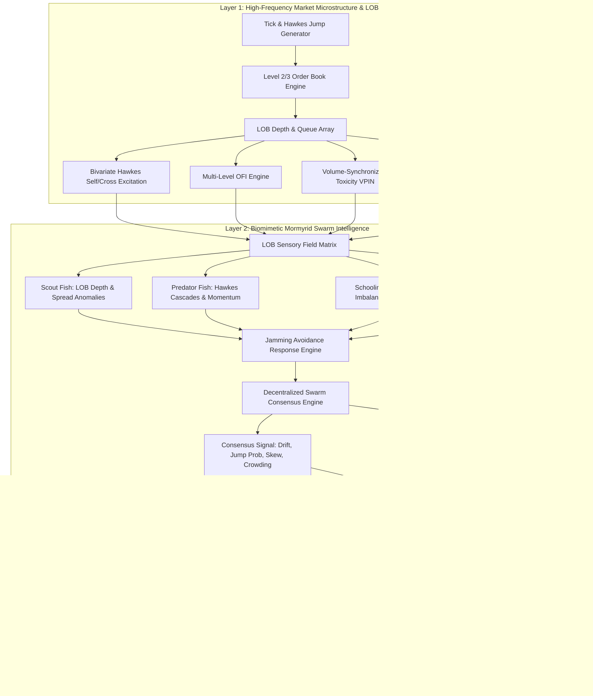

# QuantFlow - Institutional HFT & Biomimetic Swarm Intelligence Platform

[](https://github.com/planksconstant-arch/Quantflow/actions/workflows/ci.yml)
[](https://codecov.io/gh/planksconstant-arch/Quantflow)


## Executive Summary

**QuantFlow** is an institutional-grade quantitative high-frequency trading (HFT), market microstructure intelligence, and options analytics platform. It introduces **Biomimetic Mormyrid Swarm Consensus Intelligence**—a multi-agent framework inspired by weakly electric fish (Mormyridae) active electrolocation, Jamming Avoidance Response (JAR), and decentralized Byzantine-resilient consensus—integrated with real-time Level 2/3 Limit Order Book (LOB) matching, multi-feed market data routing (Finage HFT, Alpha Vantage, Marketstack, Binance, Yahoo Finance), and Swarm-Skewed Avellaneda-Stoikov market making.

---

## High-Frequency Quantitative Architecture


```mermaid
graph TB
    subgraph Market_Microstructure_Layer ["Layer 1: High-Frequency Market Microstructure & LOB"]
        LOB[Level 2/3 Order Book Engine] --> DepthFeed[LOB Depth & Queue Array]
        TickGen[Tick & Hawkes Jump Generator] --> LOB
        DepthFeed --> Hawkes[Bivariate Hawkes Self/Cross Excitation]
        DepthFeed --> OFI[Multi-Level OFI Engine]
        DepthFeed --> VPIN[Volume-Synchronized Toxicity VPIN]
        DepthFeed --> MicroPrice[Stoikov Micro-Price Estimator]
    end

    subgraph Swarm_Consensus_Layer ["Layer 2: Biomimetic Mormyrid Swarm Intelligence"]
        Hawkes & OFI & VPIN & MicroPrice --> SensoryVector[LOB Sensory Field Matrix]
        SensoryVector --> ScoutFish[Scout Fish: LOB Depth & Spread Anomalies]
        SensoryVector --> PredatorFish[Predator Fish: Hawkes Cascades & Momentum]
        SensoryVector --> SchoolingFish[Schooling Fish: Queue Imbalance & Reversion]
        SensoryVector --> SentinelFish[Sentinel Fish: Toxicity & Adverse Selection]
        
        ScoutFish & PredatorFish & SchoolingFish & SentinelFish --> JAR[Jamming Avoidance Response Engine]
        JAR --> SwarmConsensus[Decentralized Swarm Consensus Engine]
        SwarmConsensus --> ConsensusOutput[Consensus Signal: Drift, Jump Prob, Skew, Crowding]
    end

    subgraph Execution_Strategy_Layer ["Layer 3: HFT Execution & Market Making"]
        ConsensusOutput --> AvellanedaStoikov[Swarm-Skewed Avellaneda-Stoikov MM]
        ConsensusOutput --> OptimalExec[Almgren-Chriss Liquidation & TWAP/VWAP]
        AvellanedaStoikov --> HFTSim[Event-Driven Execution & Latency Simulator]
        OptimalExec --> HFTSim
    end

    subgraph Institutional_UI_Layer ["Layer 4: Institutional Trading Terminal"]
        HFTSim --> UI_LOB[Live LOB Depth Ladder & Walls]
        SwarmConsensus --> UI_Swarm[2D/3D Mormyrid Swarm Vector Visualizer]
        AvellanedaStoikov --> UI_MM[MM Quote Ladder & Inventory Risk]
        HFTSim --> UI_Telemetry[Institutional Risk & Telemetry Engine]
    end
```

---

## Biomimetic Mormyrid Swarm Intelligence

Mormyrid weakly electric fish navigate murky waters by emitting **Electric Organ Discharge (EOD)** pulses, perceiving environmental distortions, and coordinating through **Jamming Avoidance Responses (JAR)**:

| Specialized Agent Class | Biological Role | HFT Sensory Dimension | Primary Signal Function |
| :--- | :--- | :--- | :--- |
| **`ScoutFishAgent`** | Exploratory Active Electrolocation | Multi-level depth & spread dispersion | Detects hidden liquidity & spread anomalies |
| **`PredatorFishAgent`** | Aggressive Chasing & Burst Detection | Bivariate Hawkes jump cascades ($n \ge 1$) | Exploits momentum bursts & aggressive order flow |
| **`SchoolingFishAgent`** | Cohesive Swarming & Alignment | Queue imbalance & micro-price deviation | Captures mean-reversion & spread replenishment |
| **`SentinelFishAgent`** | Hazard & Jamming Perception | VPIN toxicity & crowding index | Mitigates adverse selection & inventory loss |

### Mathematical Specifications:
1. **Active Electrolocation Field Return**:
   $$f_i(X_t) = \frac{A_i}{1.0 + \sum_{k} w_{i,k} (x_{i,k} - s_k)^2}$$
2. **Jamming Avoidance Response (JAR)**:
   $$\Delta f_i = \text{sign}(f_i - \bar{f}_j) \cdot \exp\left(-\frac{\|X_i - X_j\|^2}{2\sigma_{\text{JAR}}^2}\right)$$
3. **Swarm-Skewed Avellaneda-Stoikov Reservation Price**:
   $$r_{\text{swarm}}(s, q, t) = s - q \gamma \sigma^2 (T - t) + \kappa_{\text{swarm}} \cdot \hat{\mu}_{\text{consensus}}$$

---

## Quick Start

### 1. Local Installation

```bash
# Clone the repository
git clone https://github.com/planksconstant-arch/Quantflow.git
cd Quantflow

# Create and activate virtual environment
python -m venv .venv
source .venv/bin/activate  # Linux/macOS
# On Windows: .venv\Scripts\Activate.ps1

# Install pinned dependencies
pip install -r requirements.txt
```

### 2. Launch Institutional Trading Terminal
```bash
streamlit run app.py
```
Open your browser at `http://localhost:8501`.

### 3. Run Command-Line Simulation & Deliverables
```bash
python main.py
```

### 4. Run Docker Container
```bash
# Launch interactive Streamlit terminal via Docker Compose
docker compose up terminal

# Run microsecond latency benchmarks inside Docker
docker compose run benchmark
```

---

## Testing & Benchmarks

### Microsecond Latency Benchmark Harness
```bash
python tests/benchmark_latency.py
```

Benchmarked on standard x86-64 hardware:

| Component | Operation | Mean Latency | Throughput |
| :--- | :--- | :--- | :--- |
| **Limit Order Book** | Order Insertion (`add_limit_order`) | **1.21 us** | ~825,000 ops/sec |
| **Limit Order Book** | Market Order Matching (`execute_market_order`) | **2.95 us** | ~339,000 ops/sec |
| **Microstructure Pipeline** | Multi-Level OFI + VPIN + Stoikov | **21.81 us** | ~45,800 ops/sec |
| **Avellaneda-Stoikov MM** | Optimal Bid/Ask Quote Generation | **15.09 us** | ~66,200 ops/sec |
| **Mormyrid Swarm Cycle** | 28 Agents EOD + JAR + Consensus | **714.66 us** | ~1,400 cycles/sec |

### Full Unit Test Suite (50 Tests)
```bash
pytest tests/ -v --cov=models --cov=analysis --cov=utils --cov=data
```

---

## Project Structure

```
quantflow/
├── app.py                     # Institutional Streamlit Trading Terminal (5 Tabs)
├── main.py                    # Main Entry Point & Simulation Driver
├── Dockerfile                 # Containerized Build Specification
├── docker-compose.yml         # Container Orchestration (Terminal, Benchmark, Sim)
├── CONTRIBUTING.md            # Contributor Guidelines & Development Standards
├── CODE_OF_CONDUCT.md         # Contributor Covenant Code of Conduct
├── .github/
│   ├── workflows/ci.yml       # Automated CI with Lint, Pytest, Coverage & Benchmark
│   ├── ISSUE_TEMPLATE/        # Standardized Bug & Feature Request Templates
│   └── PULL_REQUEST_TEMPLATE.md # PR Quality & Validation Checklist
├── models/
│   ├── swarm/                 # Biomimetic Mormyrid Swarm Intelligence
│   │   ├── mormyrid_agent.py  # Scout, Predator, Schooler, Sentinel Fish Agents
│   │   ├── jamming_avoidance.py # Biological Jamming Avoidance Response (JAR)
│   │   ├── consensus_engine.py  # Byzantine Swarm Consensus & Kalman Smoothing
│   │   └── afsa.py            # Artificial Fish Swarm Algorithm (AFSA) Optimizer
│   ├── microstructure/        # High-Frequency Market Microstructure
│   │   ├── order_book.py      # L2/L3 Limit Order Book & Synthetic Tick Engine
│   │   ├── signals.py         # Multi-Level OFI, VPIN, Stoikov Micro-Price
│   │   └── hawkes.py          # Univariate & Bivariate Hawkes Processes
│   ├── hft_execution/         # High-Frequency Trading Execution
│   │   ├── avellaneda_stoikov.py # Swarm-Skewed Avellaneda-Stoikov MM
│   │   ├── optimal_execution.py  # Almgren-Chriss Liquidation & TWAP/VWAP
│   │   └── hft_simulator.py      # Event-Driven HFT Backtester & Ledger
│   ├── risk/
│   │   └── hft_risk.py        # Real-time VaR, CVaR, Sharpe, Drawdown, Limits
│   ├── pricing/               # Classical Black-Scholes, Binomial, Monte Carlo
│   ├── greeks/                # Scaled Greeks Sensitivity Calculators
│   └── acceleration.py        # Numba JIT & Vectorized Routines
├── data/
│   ├── realtime_feed.py       # Multi-Source Feed (Finage, Alpha Vantage, Marketstack, Binance)
│   └── fetch_market_data.py   # Historical Data Caching Engine
├── tests/
│   ├── test_swarm.py          # Swarm Intelligence Unit Tests
│   ├── test_microstructure.py # LOB & Microstructure Signal Tests
│   ├── test_hft_execution.py  # HFT Execution & Strategy Tests
│   ├── test_models.py         # Classical Options Models & Scaled Greeks Tests
│   ├── test_realtime_feed.py  # Realtime Feed & API Integration Tests
│   └── benchmark_latency.py   # Microsecond Latency Benchmark Harness
└── requirements.txt
```

---

## Contributing

Contributions are welcome. Please read [CONTRIBUTING.md](file:///n:/quantflow/CONTRIBUTING.md) and our [CODE_OF_CONDUCT.md](file:///n:/quantflow/CODE_OF_CONDUCT.md) before submitting pull requests.

## License
MIT License. Open-source for quantitative research and algorithmic trading.
