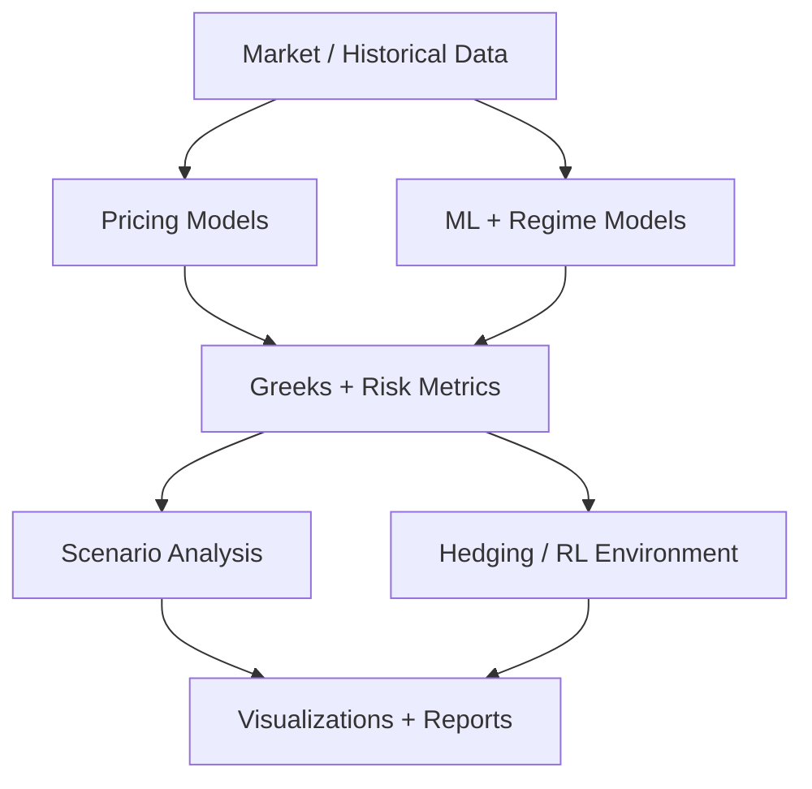

# QuantFlow

[](https://github.com/planksconstant-arch/Quantflow/actions/workflows/ci.yml)
[](https://codecov.io/gh/planksconstant-arch/Quantflow)


[](https://planksconstant-arch.github.io/Quantflow/)

QuantFlow is an options analytics platform that combines **classical quantitative finance**, **machine learning**, and **simulation tooling** for pricing, risk, and strategy evaluation.

It is designed as a practical research and prototyping workspace for:
- option valuation
- Greek sensitivity analysis
- scenario and stress testing
- volatility/risk forecasting
- deep hedging and neural SDE experimentation

---

## Table of Contents
- [Key Capabilities](#key-capabilities)
- [Architecture Overview](#architecture-overview)
- [Project Structure](#project-structure)
- [Quick Start](#quick-start)
- [Usage](#usage)
- [Testing](#testing)
- [Documentation](#documentation)
- [Docker](#docker)
- [Roadmap](#roadmap)
- [License](#license)

---

## Key Capabilities

### 1) Pricing Engines
- **Black–Scholes** analytical pricer
- **Binomial Tree** lattice-based pricer
- **Monte Carlo** simulation with confidence intervals
- Native performance modules:
  - `models/native/pricing_kernel.cpp`
  - `models/native/risk_engine.rs`

### 2) Risk Sensitivities (Greeks)
- First-order Greeks: Delta, Gamma, Theta, Vega, Rho
- Extended sensitivities in Black–Scholes module: Vanna, Vomma, Charm
- Risk-neutral density extraction (Breeden–Litzenberger) and pricing+Greeks snapshots
- Spot/time Greek surface generation utilities

### 3) AI / ML Components
- Volatility forecasting workflows
- Mispricing detection models
- Regime classification/detection
- Execution-aware signal quality scoring (edge probability, p-value proxy, cost-adjusted return, Kelly cap)
- Neural SDE modeling and training components

### 4) Strategy & Risk Analysis
- Scenario and stress-test analysis
- Backtesting and sensitivity tools
- Deep hedging environment and policy models
- Transaction-cost-aware execution modeling

### 5) Visualization & Reporting
- Dashboard-oriented chart generation
- Greeks and risk visualizations
- Deliverable generation scripts for reports and presentations

---

## Architecture Overview


```mermaid
graph TB
    A[Market / Historical Data] --> B[Pricing Models]
    A --> C[ML + Regime Models]
    B --> D[Greeks + Risk Metrics]
    C --> D
    D --> E[Scenario Analysis]
    D --> F[Hedging / RL Environment]
    E --> G[Visualizations + Reports]
    F --> G
```

---

## Project Structure

```text
Quantflow/
├── analysis/                # Backtesting, scenarios, sensitivities, hedging env
├── data/                    # Data fetch + LOB analysis
├── docs/                    # Sphinx docs and model notes
├── examples/                # Example scripts
├── models/
│   ├── greeks/              # Greeks calculators
│   ├── ml/                  # ML models (mispricing, regime, vol)
│   ├── microstructure/      # Hawkes and market microstructure models
│   ├── native/              # Rust/C++ native components
│   ├── neural_sde/          # Neural SDE modules and trainer
│   ├── pricing/             # Black-Scholes, binomial, Monte Carlo
│   └── rl/                  # Deep hedging and policy networks
├── tests/                   # Unit tests
├── utils/                   # Helpers and configuration
├── app.py                   # Streamlit app entry
├── main.py                  # Main orchestration entry
└── requirements.txt
```

---

## Quick Start

```bash
# 1) Clone
git clone https://github.com/planksconstant-arch/Quantflow.git
cd Quantflow

# 2) (Recommended) virtual environment
python -m venv .venv
source .venv/bin/activate  # Windows: .venv\Scripts\activate

# 3) Install dependencies
pip install -r requirements.txt

# 4) Run core workflow
python main.py
```

To run the Streamlit interface:

```bash
streamlit run app.py
```

---

## Usage

### Generate deliverables

```bash
python generate_deliverables.py
```

### Minimal pricing example

```python
from models.pricing.black_scholes import BlackScholesModel

model = BlackScholesModel(S=100, K=105, T=0.5, r=0.03, sigma=0.25, q=0.0)

call = model.call_price()
put = model.put_price()
greeks = model.all_greeks("call")

print(call, put)
print(greeks)
```

---

## Testing

Run all tests:

```bash
pytest tests -v
```

Run focused model tests:

```bash
pytest tests/test_models.py -v
pytest tests/test_neural_sde.py -v
```

---

## Documentation

Primary docs and notes:
- `docs/index.rst`
- `docs/NEURAL_SDE.md`
- `docs/DEEP_HEDGING.md`
- `docs/MICROSTRUCTURE.md`
- `docs/RISK_ANALYSIS.md`
- `docs/MODEL_VALIDATION.md`

---

## Docker

```bash
docker build -t quantflow:latest .
docker run --rm quantflow:latest python main.py
```

---

## Roadmap

Planned and active areas include:
- stronger model validation and calibration diagnostics
- richer risk attribution and portfolio overlays
- production-grade API packaging and deployment paths
- tighter integration between microstructure and hedging modules

---

## License

This project is released under the MIT License.
